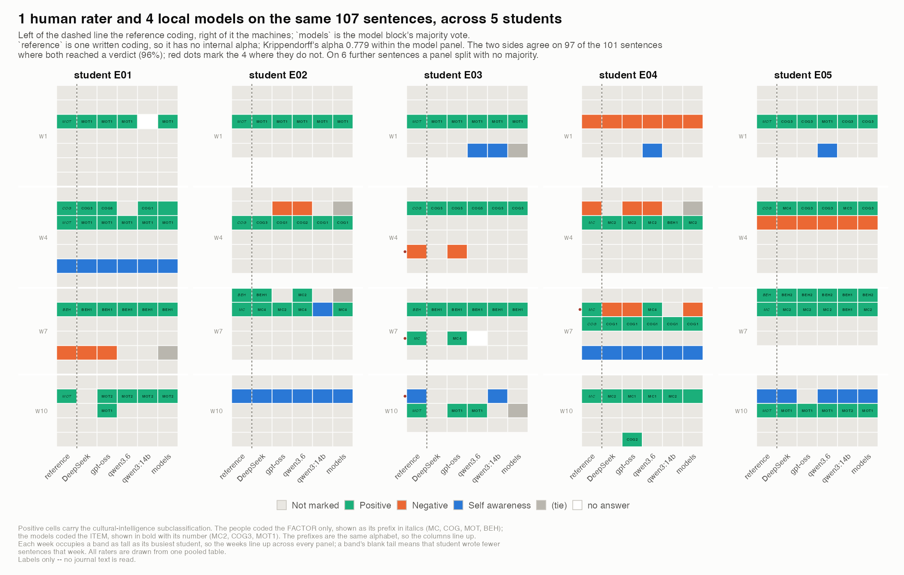
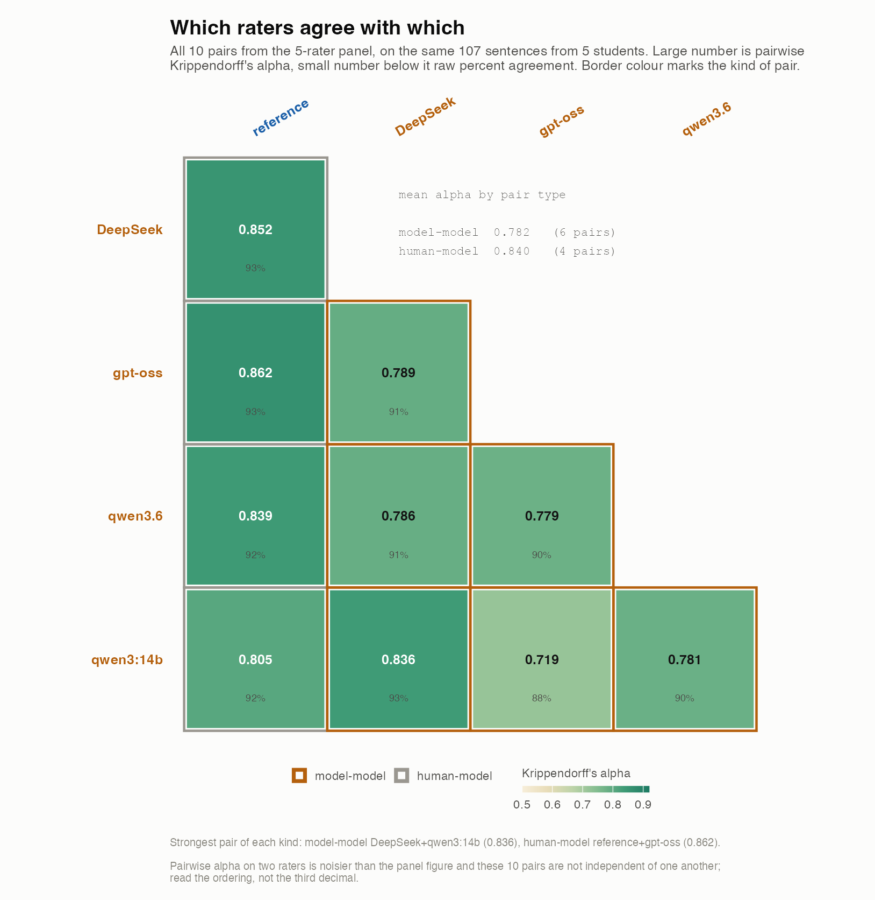

# Rating COIL reflection journals with local LLMs

Can locally-run open-weight language models apply a qualitative coding scheme to
student reflection journals as consistently as trained human coders?

Follow-up study to an 11-week COIL course ("Omics in Oncology", UZH Zurich +
UU Utrecht). Students wrote reflection journals in weeks 1, 4, 7 and 10. Three
human raters code the text for intercultural competence; this repository adds
four locally-hosted models as further raters and measures agreement between
everyone.

**The unit is a sentence.** Complete journals go in, every sentence comes out
with one class label, and sentences marked `Positive` additionally get one of the
20 items of the Cultural Intelligence Scale plus the factor it rolls up to.

## What it looks like

Both figures below are computed from the **invented** journals in
[`data/example_journals_sections/`](data/example_journals_sections/) and the
written reference coding that ships beside them, so everything in them is
reproducible from a clone:

```
Rscript scripts/24_mock_pooled.R
Rscript scripts/21_figures_pooled.R --pooled mock_results/pooled_units_example_sections.csv --tag _example
```



Every sentence of five journals against every rater, in document order, banded by
week. Left of the dashed line the reference coding, right of it four models;
`models` is their majority. `Positive` cells carry the cultural-intelligence
subclassification — the reference coded the **factor** (italic prefix), the
models the **item** (bold, numbered), so the two line up in the same alphabet.
Red dots mark where the model majority departs from the reference. **They agree
on 97 of the 101 sentences where both reach a verdict (96%).**



The same run as an agreement matrix: every pair of raters, Krippendorff's alpha
above, raw percent agreement below.

The equivalent figures for the real cohort are not published — they carry
per-sentence codings of real students. See
[PUBLIC_SUBSET.md](PUBLIC_SUBSET.md).

## Data protection — read this first

The journals are **personal data** under the Swiss FADP and, because the Utrecht
students are in the EEA, the GDPR. Under the UZH/ETH four-level classification
they are **confidential**, and cloud AI tools are approved for `public` data
only. That is why every model here runs **locally via Ollama**: no passage ever
leaves the machine.

The repository is built so it cannot leak text:

| Stays local (gitignored) | Committable |
|---|---|
| `journals/`, `test_journal/`, any `*.docx` | code, `config/`, `prompts/` |
| `data/units_*.csv` (real passages) | `data/units_TEMPLATE.csv`, `data/units_synthetic.csv` (invented text) |
| `cache/` — model rationales and reasoning traces, which quote passages | `results/` — pseudonymous ids and labels only |
| `setting/*.pdf`, `setting/ClassificationScheme.txt` — third-party copyright | `setting/README.md` |

**The measurement instrument is supplied locally, not redistributed.** The
Cultural Intelligence Scale is copyrighted, so `config/codebook.yml` carries only
the item **codes**, the **factor** each belongs to and whether this course
**administered** it — structural facts the analysis needs, which are not the
copyrighted expression. The item wording is read at load time from
`setting/ClassificationScheme.txt`, which is gitignored and blocked by the
pre-commit hook. [`setting/README.md`](setting/README.md) tells anyone cloning the
repository what to put there.

A missing or mismatched file is a **hard error, not a fallback**: coding against
bare item codes would yield confident-looking labels from a model that had never
seen the items, and nothing downstream would look wrong. The split is transparent
to the pipeline — the rendered prompts are byte-identical, so the response cache
is unaffected.

`tools/pre-commit` blocks these paths even against `git add -f`. Install it with
`Rscript scripts/00_setup.R`.

Open items for the collaborators — including whether the existing ethics consent
covers automated analysis — are in `Questions2discuss.txt` (not published) (working notes, not published).

## The coding scheme

Defined once in [`config/codebook.yml`](config/codebook.yml) (v5), which drives
both the prompts and the label validation.

**Stage 1 — one code per sentence:**
`Not marked` · `Positive` · `Negative` · `Self awareness`
(originally the yellow / purple-pink / red highlights in the Word journals.)

`Not marked` is the **default, and the expected answer for most sentences**. A
sentence is marked only when it actually says something about cultural or
intercultural experience — another culture, the international collaboration
itself, or the student's own cultural disposition. Everything else stays
unmarked, *however positive or negative its tone*: enthusiasm about a lecture and
fury about a deadline are both `Not marked`. `Not marked` is also the answer when
the coder cannot decide.

That scope gate is the first decision rule in the codebook, and the thing most
likely to go wrong — a language model's instinct is to find something positive in
every sentence. `scripts/04_smoke_test.R` exists mainly to catch that: 18 of its
30 fixture sentences must come back unmarked, and a model that marks more than a
quarter of them fails the run.

**Stage 2 — cultural intelligence, when the sentence is `Positive`.** The model
picks **one of the 20 questionnaire items** of Ang & Van Dyne's Cultural
Intelligence Scale (`setting/ClassificationScheme.txt`), and the **factor is
derived from the item** — `Metacognitive` · `Cognitive` · `Motivational` ·
`Behavioural`. So the scheme has 24 labels in two nested levels, the factor is
never asked for separately, and the two levels cannot contradict each other.
Results carry both: `cq_item` and `cq_type`.

Only 6 of the 20 items were administered as a questionnaire in the course
(flagged `course_item` in the codebook); the other 14 are a coding vocabulary,
not measured constructs. Several items describe things this course cannot produce
— marriage systems, shopping abroad — and stage 2 is nonetheless a forced choice,
matching the human protocol. Expect most items to go unused; that is reported
rather than hidden.

> **On the 2026-07-28 human pilot.** Moving the trigger back to `Positive` means
> factor labels once again describe the same kind of text the pilot coded, so the
> comparison is *conceptually* available. It is not *mechanically* available: the
> pilot is **paragraph**-level and this is **sentence**-level, and unit ids have
> deliberately different shapes (`..._q01_s02` vs `..._u01`) so the two can never
> be joined by accident. **The decision is not to force it** — this round is
> LLM-only, and human data may be generated again later. `para_id` is kept on
> every row so sentences can be aggregated back to paragraphs when that happens.

## Why two calls instead of one

A single schema offering a `"None"` CQ option was tried first. Two of the four
models assigned a substantive primary code and then returned `cq_type: "None"` —
a protocol violation. So stage 2 is a separate call whose enum contains exactly
the permitted answers. The schema makes the violation *unrepresentable* rather
than merely discouraged, which is more robust than asking the model to comply.

The same principle applies to every field: each declares its bounds, because a
bare `{"type":"number"}` let `gemma4:e4b` return a confidence of `5.0` on a 0–1
scale on every single call.

## Skew changes the statistics

By design most sentences are `Not marked`. That is the right coding decision and
a nuisance for the arithmetic: when one category dominates, expected agreement is
already high, so Krippendorff's alpha is pushed down even when the coders behave
identically — the "kappa paradox". A single headline alpha would therefore
understate the raters and tell you nothing about *where* they differ.

So agreement is reported as two separate decisions plus a breakdown:

- **Detection** — marked vs `Not marked`, two categories. Did the raters flag the
  same sentences at all? Report alpha **and Gwet's AC1** here, since AC1 is the
  prevalence-robust one. The human pilot showed exactly this gap: detection alpha
  0.271 against AC1 0.716 on the same data.
- **Choice** — among sentences everyone marked, which of the three? This is the
  question the codebook definitions actually govern.
- **Per-code alpha**, one present/absent reliability per code, which says *which*
  code the raters disagree about — a thing no single coefficient can tell you.

The set-valued machinery (MASI / Jaccard differences) is still present and still
validated; with one label per sentence every rating is a singleton set, so the
three difference functions coincide and `--metric` stops mattering. It remains
because paragraph-level runs (`--paragraphs`) can still be multi-label.

CQ reliability is likewise reported at **both** levels — 4 factors and 20 items.
The gap between them is the share of disagreement that is only about *which item
inside an agreed factor*, which a factor-only figure hides and an item-only
figure overstates as total disagreement.

## Quickstart

**Just want to know how the models would code one sentence?** Edit `ask.txt`,
then:

```bash
Rscript scripts/09_ask.R
```

Same codebook, prompts and protocol as a real run; every model's answer side by
side with its reasoning. Nothing is written to `results/`.

**[RUNBOOK.md](RUNBOOK.md) is the step-by-step guide** — what to check at each
stage, and a troubleshooting table. Short version:

```bash
Rscript scripts/00_setup.R                          # deps, config, model servers
Rscript scripts/04_smoke_test.R                     # does the scope gate hold?
Rscript scripts/01_prepare_units.R --dir journals --out data/units_journals.csv --preview
Rscript scripts/02_rate.R data/units_journals.csv --dry-run   # see the exact prompt
Rscript scripts/02_rate.R data/units_journals.csv             # the real run
Rscript scripts/07_alpha.R --label journals                   # agreement among models
Rscript scripts/06_show_units.R --label journals --only-disagreed   # where they differ
```

**Review the units file before rating.** `01_prepare_units.R --preview` prints
every sentence, and flags any that look like a segmentation problem (over 400 or
under 15 characters — usually a missing full stop or an abbreviation the splitter
does not know). Re-splitting later changes every `unit_id`, which invalidates the
cache and breaks every join, so this is the moment to look.

Output names are derived from the units file, so datasets never overwrite each
other: `data/units_journals.csv` → `results/ratings_journals_main.csv`. Rating a
subset merges into the existing file rather than replacing it.

Runs are **cached per call and safe to interrupt** — re-running resumes rather
than restarting. Sentence units are shorter but far more numerous than
paragraphs: budget on the order of **20–30 seconds per sentence** for the
four-model panel, and note that stage 2 only fires on `Positive` sentences, so
the total depends on how much of the journal is actually intercultural.

Try it on invented text first. Two fabricated sets ship with the repository, both
entirely written for it and safe to share:

| Set | Units | Layout | Use it for |
|---|---:|---|---|
| [`data/example_journals_sections/`](data/example_journals_sections/) | 107 sentences | **`sections` — the real document layout** | **start here.** Five students, weeks 1/4/7/10, two bullet questions each, mostly ordinary chatter with one or two intercultural sentences per section. Intended labels documented in its README |
| [`data/example_journals/`](data/example_journals/) | 88 sentences | `marker` | the older set, five unrelated disciplines |
| `data/synthetic_journals/` | — | `marker` | closer to this course's own subject matter |
| `data/units_synthetic.csv` | 30 sentences | units table | the prompt regression test, **with expected codes** |

## Layout

```
config/codebook.yml     the coding scheme: codes, CQ items, decision rules
config/run.yml          providers, models, sampling profiles, context mode, paths
setting/                the Cultural Intelligence Scale and its source paper
prompts/                stage 1 and stage 2 templates ({{placeholders}})
R/codebook.R            load the scheme, render prompt fragments, item->factor roll-up
R/units.R               read/validate units; deterministic sentence + paragraph splitter
R/llm.R                 schema-constrained client (Ollama + OpenAI-compatible),
                        per-call cache, preflight
R/rate.R                the two-stage runner, manifest, output splitting
scripts/00_setup.R      dependencies, config check, model servers
scripts/01_prepare_units.R   journals -> sentence units
scripts/02_rate.R       run the panel (--dry-run shows both prompts verbatim)
scripts/03_compare.R    models vs the human coding (deferred: LLM-only for now)
scripts/04_smoke_test.R the scope-gate regression test
scripts/05_check_provider.R  probe one provider's structured-output behaviour
scripts/06_show_units.R every model's label for every unit, side by side
scripts/07_alpha.R      agreement among the models: overall, per code, per item,
                        leave-one-out, by group, self-consistency
scripts/08_vs_expected.R  a run against a written reference reading, with the
                        detection and choice steps reported separately
scripts/09_ask.R        rate one sentence or paragraph with the whole panel now
                        (edit ask.txt, run it) -- for "how would they code this?"
tools/make_fixture.R    rebuild the smoke-test fixture
tools/make_expected_labels.R  rebuild the example set's reference labels
test_for_consistency/   human inter-rater reliability + all coefficients (validated)
```

## Model servers and the panel

Two provider types, both on premises — **no cloud provider is configurable
anywhere in this repository**, since passages are confidential personal data:

- **`local_ollama`** — the Ollama daemon on this machine.
- **`fgcz_vllm`** — the FGCZ institute vLLM, reached over its OpenAI-compatible
  `/chat/completions` endpoint (this is how the FGCZ-hosted DeepSeek is used).

**The panel is three models** (2026-08-21): `qwen3.6:latest`, `gpt-oss:20b` and
`DeepSeek-V4-Flash-DSpark`.

**Three, not four, on purpose.** An even panel cannot break a tie: with four
models, 6 of 107 units on the example set came back 2–2 with no majority, and
every one was a genuinely borderline sentence. An odd panel removes that
category of non-answer structurally. (Ties can still occur when a model *fails*
to answer and leaves an even number of votes — that happened once out of 107.)

Three models were dropped, each with its reason recorded next to it in
`run.yml`, because "we dropped it" is a methods statement that needs its
justification attached:

| | why |
|---|---|
| `llama3.1` | leave-one-out agreement *improved* by 0.046 without it; worst self-consistency of the six (0.726, and −0.056 on the CQ factor); `Metacognitive` on 16 of 16 factor calls |
| `gemma4` | returned a confidence of `5.0` on a 0–1 scale on every call until the schema was given explicit bounds |
| `qwen3:14b` | indistinguishable from `qwen3.6` on the primary code (92% exact each, detection κ within 0.01, leave-one-out delta < 0.003 either way) but much weaker on stage 2 — CQ factor 76% vs 95%, CQ item 47% vs 81% — and lower self-consistency (0.855 vs 0.927) |

Dropping `qwen3:14b` has a known cost: the panel is now all "large" tier, so it
cannot support a claim about whether model **size** matters, and the same-family
`qwen3` vs `qwen3.6` comparison is gone. Both were secondary aims.

Re-enabling any of them means re-running every profile: panel membership is part
of what the agreement figures measure. A ratings file keeps every model ever run
against those units — that is right, the data is the data — so `07_alpha.R` and
`08_vs_expected.R` take `--only` / `--exclude` to analyse a run *at the panel
that is current*, and name their output files accordingly.

Endpoints are read from the environment, because the FGCZ AI-usage policy says
explicitly not to hardcode them — they drift. Put them in `~/.Renviron`:

```
FGCZ_LLM_BASE_URL=http://<host>:<port>/v1
FGCZ_LLM_API_KEY=dummy
```

Then list the exact model id the server reports (`curl $FGCZ_LLM_BASE_URL/models`)
in `config/run.yml` and set `enabled: true`. Reaching it requires being on the
FGCZ network.

Statistics are **not** reimplemented here: `scripts/03_compare.R` sources
`test_for_consistency/R/agreement.R`, whose coefficients are checked against
`irrCAC` and analytic identities by 21 tests in `validate_agreement.R`. Each
model enters as one more column of the ratings matrix.

## Units — the input format

A *unit* is one **sentence**, receiving exactly one primary code. **Units are
produced mechanically; no model ever decides what a unit is.**

The input is **one plain-text file per student — the complete journal**, named
after the pseudonymous student id (`99.txt` → `student_id` `99`). Two layouts are
recognised, and the reader says which one it found.

**`sections` — the real documents.** A heading per week gives the time dimension,
the journal's own questions are bullet-marked and are *never rated*, and the text
under each question is the student's answer:

```
Week 1
- What did you expect from the collaboration?
The answer. It may run over several sentences.

- How did the first joint session go?
Another answer.

Week 4
- ...
```

Reading is line-based, not paragraph-based, because in these documents a question
and its answer are often on consecutive lines with no blank line between them —
which a paragraph reader would merge into a single unit. Bullets are matched by
**Unicode code point**, not by character literal: a `[•●]` regex class fails in
some locales, and so does comparing against a literal `•` when the file's
encoding and the session's locale disagree — which silently demoted every bullet
question to the weaker "ends in a question mark" test the first time this ran.

Text before the first week heading is treated as **front matter** — a title, a
name — and is dropped rather than rated, unless `--week N` says otherwise.

**`marker` — the invented example journals here.** Paragraphs prefixed with an
inline week marker:

```
w1.1: First paragraph of week one. It may hold as many sentences as it likes.

w4.1: A paragraph from week four ...
```

Either way, build the whole cohort in one command:

```bash
Rscript scripts/01_prepare_units.R --dir journals --out data/units_all.csv --preview
```

Everything **not** turned into a unit — week headings, the questions themselves,
front matter — is listed with its reason. Read that list: it is how you confirm
the document was understood the way you meant it. A question recognised only by
its trailing `?`, with no bullet, is called out separately, because it might
really be a student's sentence that has just been excluded from rating.

Every paragraph is split into sentences by `split_sentences()` in
[`R/units.R`](R/units.R) — a fixed, visible rule set, not a model and not an
external tokeniser, so the unit list is reproducible from this repository alone
and reviewable by the raters. It shields abbreviations (`SENTENCE_ABBREV`),
decimals, initials and ellipses, then breaks only where terminal punctuation is
followed by whitespace and something that can start a sentence. Its known limits
are stated in the code: a missing full stop leaves two sentences as one unit, a
semicolon list stays one unit, and an unlisted abbreviation splits mid-sentence.
All three are visible in the units file, which is why that file is reviewed
*before* rating.

The **parent paragraph travels with each sentence** in the `context` column, and
`context_mode: unit_context` shows it to the model marked explicitly as
reference material that must not itself be coded. Without it, `It was great.`
would be uncodeable.

In the `marker` layout `w1:` works too — the `.1` is a **paragraph number, and
adding it is strongly recommended**, because it makes ids survive editing. The
`sections` layout has no such anchor: real documents carry no numbering, so ids
come from document order and **editing an answer renumbers the sentences after it
in that question**. Freeze the documents before rating.

**Nothing is dropped silently.** Every non-empty block becomes a paragraph and
every sentence becomes a unit; `min_chars` defaults to 0 and question-prompt
detection is opt-in (`--detect-questions`). Anything the splitter does discard is
listed with its reason.

`--paragraphs` restores paragraph units, which is what the 2026-07-28 human pilot
used. Alternatively supply a units table directly — see
`data/units_TEMPLATE.csv`.

**Unit ids** come in three distinguishable shapes, so a run at one granularity
can never be silently joined to labels at another:

| Layout and level | Shape |
|---|---|
| sentence, `sections` | `<student>_w<week>_q<qq>_s<ss>` |
| sentence, `marker` | `<student>_w<week>_p<pp>_s<ss>` |
| paragraph (the human pilot's) | `<student>_w<week>_u<nn>` |

The id carries the **week** and, in the real layout, **which question** the
sentence answers — so the time dimension and the prompt are both recoverable from
the id alone.
**The alignment sheet has no unit ids of its own and is aligned by row position —
keep the units file in the same order and never re-sort it.**
`scripts/03_compare.R` stops rather than guessing if the ids do not line up, and
`para_id` is kept on every row so sentences can be aggregated back up to their
paragraph when a comparison with the pilot is wanted.

## Configuration worth knowing

- **`context_mode`** (`config/run.yml`) — `unit` (current: passage alone),
  `unit_question` (adds the journal question), `unit_question_context` (adds
  neighbouring text). The humans read the whole journal, so `unit` is a *harder*
  task than theirs; a low score under `unit` is partly an artefact of the setup.
- **`profiles`** — `main` is one run at temperature 0 (the headline rating).
  `consistency` is 5 runs at temperature 0.7 with rotated label order, to
  measure whether a model agrees with *itself*. Not run yet; enable with
  `--profile consistency`.
- **Model list** — note `gemma4:latest` and `gemma4:e4b` are the same image
  (`c6eb396dbd59`); enabling both would enter one model as two raters.
- Every run writes `results/manifest_<profile>.json` with model ids, prompt and
  codebook SHA1s, seeds, sampling options and the Ollama version, so a results
  directory alone reconstructs the methods section.

## Where the LLM protocol is stricter than the human one

To prompt a model at all, the tie-breaks the humans left implicit must be
written down — for example that "I know a few words of their language" is
cultural knowledge and not `Self awareness`, despite starting with "I". Those
rules live under `decision_rules` in the codebook, and several of them exist only
because a model got a fixture sentence wrong in a way a written rule could
prevent.

This is a genuine asymmetry and belongs in the paper's limitations: the model
follows a more specified protocol than the humans did. It cuts *against* the
humans, not the models. Item 5c of `Questions2discuss.txt` (not published) proposes the fix —
have the humans re-code under the same explicit rules so both sides share one
protocol.

## Current status

**Codebook v5 (2026-08-20)** changed the scheme substantially: sentence units,
one label per sentence, `Not marked` as the default, the CQ subclassification
moved back to `Positive` and taken to item level, and a four-model panel.

Done: human reliability module (validated, 36 checks); codebook, prompts, cached
client for both providers, two-stage runner, sentence and document parsers,
comparison and agreement scripts, scope-gate regression test.

**Everything in `results/` predates v5 and is not comparable with it** — it was
produced with paragraph units, multi-label codes and a six-model panel. Keep it
for the record if you like, but do not pool it with anything new.

**The design is a six-rater panel** (settled 2026-08-21). The three human raters
code the journals independently; this repository is the **automated arm** — three
locally-hosted models added as further raters, applying the identical written
codebook. The models supplement the human coding, they do not replace it.

The analysis plan for combining the two is written down **before the data exist**,
in `paper/supplementary_methods.md` (draft, not published) §S8. Its two
load-bearing decisions:

- **The model panel enters as ONE rater** (its modal answer), not three. The three
  models read an identical prompt and share training data, so their mutual
  agreement (0.78–0.86) is far higher than anything expected between independent
  coders; entering them as three would let a correlated block dominate the
  coefficient. The three-rater version is reported as a sensitivity analysis.
- **The primary question is not whether the models are right.** It is whether the
  model panel agrees with the human panel about as well as the human raters agree
  with each other. That is falsifiable, and it does not require treating the human
  labels as ground truth — which the pilot figures (α = 0.604 primary, 0.033 on
  the CQ factor) say they are not.

Until the human sentence-level coding exists, `scripts/07_alpha.R` (models only,
no reference needed) is the working analysis step. `scripts/03_compare.R` still
reads the paragraph-level pilot sheet and **needs extending** to sentence-level
input with two rater types — that is the main known gap in the tooling.

Open, in order:

1. Ratify the scope gate — the three raters code the 30 fixture sentences
   independently and compare. It is the definition that now decides most of the
   data, and two specific sentences are flagged as the starting point
   (`Questions2discuss.txt` (not published) item 0e).
2. Decide `context_mode` for the real run — with or without the journal question
   (item 0h). It changes every cache key, so decide before, not during.
3. Run the three-model panel on the real journals, then `07_alpha.R`.
4. Run `--profile consistency`, which in this design is essential rather than
   nice to have.

## Licence, and what it does not cover

The code, configuration, prompt templates and the invented example journals are
released under the **MIT Licence** — see [LICENSE](LICENSE).

Three things in scope of this repository are **not** covered by that licence, and
the distinction matters:

- **The Cultural Intelligence Scale** is third-party copyright and is *not
  included here*. `config/codebook.yml` carries only item codes and their factor
  membership; the wording is supplied locally by each user (see
  [`setting/README.md`](setting/README.md)). Cite the scale from its original
  publication — this repository gives you no licence to it and no citation of
  convenience.
- **The model weights.** Each model carries its own licence from its own
  publisher. Nothing here grants any right to them.
- **The journals.** Personal data under FADP/GDPR, never in version control, and
  no licence could make them shareable.

> **Two things for the co-authors to confirm before publication.** The copyright
> line names one author; if the collaborators are to hold copyright jointly, they
> should be added. And because the work was produced in an institutional context,
> check whether institutional policy requires the university to be named as
> copyright holder instead of, or alongside, the authors. Both are one-line edits
> to `LICENSE`, but they are decisions rather than defaults.
